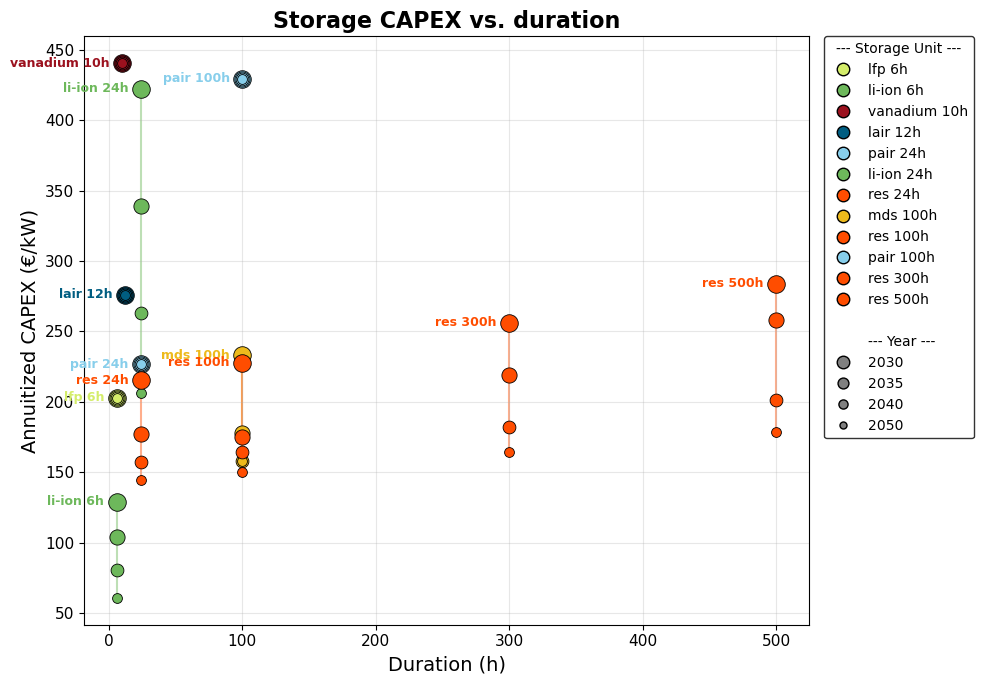

<!--
SPDX-FileCopyrightText: Contributors to PyPSA-Eur <https://github.com/pypsa/pypsa-eur>
SPDX-FileCopyrightText: Open Energy Transition gGmbH
SPDX-License-Identifier: CC-BY-4.0
-->

[](https://github.com/PyPSA/pypsa-eur/releases)
[](https://pypsa-eur.readthedocs.io/en/latest/?badge=latest)
[](https://github.com/pypsa/pypsa-eur/actions/workflows/test.yaml)

[](https://doi.org/10.5281/zenodo.3520874)
[](https://doi.org/10.5281/zenodo.3938042)
[](https://snakemake.readthedocs.io)
[](https://discord.gg/AnuJBk23FU)
[](https://api.reuse.software/info/github.com/pypsa/pypsa-eur)

<table>
<tr>
<td>

# ULDES requirement in Germany

</td>
<td align="right">


</td>
</tr>
</table>

This repository is a soft-fork of [PyPSA-Eur](https://github.com/pypsa/pypsa-eur) and contains the entire project **Ultra long duration energy storage (ULDES) requirement in Germany** carried out by [Open Energy Transition (OET)](https://openenergytransition.org/)<sup>*</sup>, Sagax Capital (Singapore) (represented by Alex Turnbull), and [Noon Energy](https://www.noon.energy/), including code and report. The philosophy behind this repository is that no intermediary results are included, but all results are computed from raw data and code. The structure is also inspired by [cookiecutter-project](https://github.com/PyPSA/cookiecutter-project).

This repository is maintained using [OET's soft-fork strategy](https://open-energy-transition.github.io/handbook/docs/Engineering/SoftForkStrategy). OET's primary aim is to contribute as much as possible to the open source (OS) upstream repositories. For long-term changes that cannot be directly merged upstream, the strategy organizes and maintains OET forks, ensuring they remain up-to-date and compatible with upstream, while also supporting future contributions back to the OS repositories.

## Project context
The aim of this project is to study the ULDES requirement in Germany by means of multi-scenario analysis using PyPSA-Eur. Noon's **reversible electrofuels battery storage (`res`)** (see [here](https://www.noon.energy/technology) for more details about the technology) is added as a new storage option to the ones already available in PyPSA-Eur, i.e.:
- **batteries**: lithium-ion, lithium iron phosphate, vanadium redox flow, iron-air (the latter added in the context of the [form-energy-storage](https://github.com/open-energy-transition/form-energy-storage) project).
- **mechanical storage**: liquid-air, adiabatic compressed air, pumped hydro.
- **chemical storage**: power-to-hydrogen, power-to-synthetic fuels.

In particular, the project focuses on the competition between: the `res` storage, claimed to reach durations above 100 hours and referred to as ULDES; medium-duration technologies, i.e., iron-air — referred to as medium duration storage (MDS) — and adiabatic compressed air types; short-duration technologies, i.e., the remaining batteries and mechanical storage options listed above. An overview of cost and duration assumptions of those storage technologies is depicted in [Figure 1](#figure-1). For more details on techno-economic characterization, see the [pypsa/technology-data](https://github.com/pypsa/technology-data) repository and the [1-Modeling of the `res` technology](#1-modeling-of-the-res-technology) section.

<a id="figure-1"></a>
<p align="center">

<br>
<em>Figure 1 - Annuitized capital costs and duration of different PyPSA-Eur storage types.</em>
</p>

Quick links:
- `form-energy-storage` repository: https://github.com/open-energy-transition/form-energy-storage
- OET soft fork of PyPSA-Eur: https://github.com/open-energy-transition/pypsa-eur
- PyPSA-Eur documentation: https://pypsa-eur.readthedocs.io/en/latest/
- PyPSA documentation: https://pypsa.org/

## Project setup
The project setup follows the general [form-energy-storage](https://github.com/open-energy-transition/form-energy-storage) project scope, to allow comparability, as both projects aim to assess long-duration storage (LDS) potential for Germany's decarbonization. Also, such a scope is considered a good balance between spatial and temporal resolutions and computational cost.

* Spatial scope:
    * Model boundaries: Germany, along with its grid neighboring countries and Italy, covering 12 out of the 34 default countries in PyPSA-Eur.
    * Spatial resolution: 52 buses in total, out of which 15 nodes are in Germany.
* Temporal scope:
    * Time horizon: 2030, 2035, 2040, 2050, to cover both the near- and long-term potential applications of ULDES. In this regard, load increase factors from [TYNDP 2026 scenarios](https://2026.entsos-tyndp-scenarios.eu/download/) are applied to each planning horizon.
    * Time resolution: 3 hours, which is considered a suitable compromise between computational cost and the model capability to capture the grid and storage dynamics.
* Sectoral scope: power, heating, and transport sectors, which are considered the main sectors accounting for energy storage technologies.

## Project implementation

### 1-Modeling of the `res` technology
The techno-economic characterization of the `res` technology is provided by Noon Energy. The parameters are listed in [Table 1](#table-1) and defined as custom input data in [`data/custom_costs_res_noon_energy.csv`](data/custom_costs_res_noon_energy.csv).

As for all the storage options in PyPSA-Eur, the `res` technology can be either modelled as `Storage Unit` or `Store` + pair of charging and discharging `Links` (for more details, see this [example](https://docs.pypsa.org/latest/examples/replace-generator-storage-units-with-store/)):
- `Storage Unit`: default option. If this is the case, a **single capex (€/kWh)** must be used and is derived by summing up **capex energy + capex power/duration**. In particular, 4 durations are considered: 24h, 100h, 300h, and 500h, to cover the whole spectrum of PyPSA-Eur storage durations (the corresponding parameters are already available in [`data/custom_costs_res_noon_energy.csv`](data/custom_costs_res_noon_energy.csv)).
- `Store` + `Links`: this is added as a sensitivity. If this is the case, the parameters in [Table 1](#table-1) are directly used. Also, the constraint [`add_res_constraints`](scripts/solve_network.py#L1057) accounting for the maximum charge power capacity is added in [`scripts/solve_network.py`](scripts/solve_network.py).

*Table 1 - Techno-economic parameters of the `res` technology across planning horizons.*
<a id="table-1"></a>

| Parameter | 2030 | 2035 | 2040 | 2050 |
| --- | --- | --- | --- | --- |
| Capex energy ~(€2025/kWh_charge) | 1.3 | 1.0 | 0.9 | 0.7 |
| Capex power ~(€2025/kW_discharge) | 1,593 | 1,345 | 1,150 | 1,062 |
| Fixom (%/year) | 5.3 | 4.9 | 5.4 | 5.4 |
| Lifetime (year) | 30 | 30 | 30 | 30 |
| Discharge efficiency (-) | 0.75 | 0.75 | 0.75 | 0.75 |
| Charge efficiency (-) | 0.85 | 0.85 | 0.85 | 0.85 |
| Max charge power capacity (kW/kW_discharge) | 5:1 | 5:1 | 5:1 | 5:1 |

### 2-Scenario definition
All the 13 scenarios available for the study are defined in [`scenarios.noon.yaml`](config/scenarios.noon.yaml), whereas the common settings are defined in [`config.noon.52buses.3h.final.yaml`](config/config.noon.52buses.3h.final.yaml). These scenarios can be grouped in 5 types and are summarized in [Table 2](#table-2):
1) Base case: 2030 greenfield optimization w/o MDS and `res`.
2) Greenfield LDS cases: greenfield optimization across all the planning horizons, w/ LDS. These scenarios do not allow the expansion of nuclear- and biomass-based power generation, aligning to the [form-energy-storage](https://github.com/open-energy-transition/form-energy-storage) project.
3) Brownfield LDS cases: brownfield single-year optimization across all the planning horizons, w/LDS. These scenarios do not allow the expansion of nuclear- and biomass-based power generation, whereas they include the existing fleet.
4) Greenfield LDS case with 2023 weather year and 2030 target year.
5) Greenfield LDS case with *store + links* `res` option and 2030 target year.

*Table 2 - Overview of the study scenarios.*
<a id="table-2"></a>

<table>
<tr>
<th>Scenario</th><th>Weather year</th><th>Planning horizon</th><th>Foresight</th><th><code>res</code> modeling</th><th>Extendable storage*</th><th>Extendable generation</th>
</tr>
<tr>
<td><code>cy2021-base-2030</code></td>
<td rowspan="9">2021</td>
<td rowspan="2">2030</td>
<td rowspan="5">Overnight (Greenfield)</td>
<td>–</td>
<td>li-ion 6h, li-ion 24h, lfp, vanadium, lair, pair 24h, pair 100h, H2 (Store)</td>
<td rowspan="5">solar, solar-hsat, onwind, offwind-ac, offwind-dc, offwind-float</td>
</tr>
<tr>
<td><code>cy2021-lds-2030</code></td>
<td rowspan="11">Storage Unit</td>
<td rowspan="9">li-ion 6h, li-ion 24h, lfp, vanadium, lair, pair 24h, pair 100h, mds, res 24h, res 100h, res 300h, res 500h, H2 (Store)</td>
</tr>
<tr>
<td><code>cy2021-lds-2035</code></td>
<td>2035</td>
</tr>
<tr>
<td><code>cy2021-lds-2040</code></td>
<td>2040</td>
</tr>
<tr>
<td><code>cy2021-lds-2050</code></td>
<td>2050</td>
</tr>
<tr>
<td><code>cy2021-lds-brownfield-2030</code></td>
<td>2030</td>
<td rowspan="4">Myopic (Brownfield)</td>
<td rowspan="4">solar, solar-hsat, onwind, offwind-ac, offwind-dc, offwind-float, CCGT, OCGT</td>
</tr>
<tr>
<td><code>cy2021-lds-brownfield-2035</code></td>
<td>2035</td>
</tr>
<tr>
<td><code>cy2021-lds-brownfield-2040</code></td>
<td>2040</td>
</tr>
<tr>
<td><code>cy2021-lds-brownfield-2050</code></td>
<td>2050</td>
</tr>
<tr>
<td><code>cy2023-lds-2030</code></td>
<td>2023</td>
<td rowspan="4">2030</td>
<td rowspan="4">Overnight (Greenfield)</td>
<td rowspan="4">solar, solar-hsat, onwind, offwind-ac, offwind-dc, offwind-float</td>
</tr>
<tr>
<td><code>cy2021-lds-lowLiIon-2030</code></td>
<td>2021</td>
<td rowspan="2">li-ion 6h, li-ion 24h, lfp, vanadium, lair, pair 24h, pair 100h, mds, res 24h, res 100h, res 300h, res 500h, H2 (Store)**</td>
</tr>
<tr>
<td><code>cy2023-lds-lowLiIon-2030</code></td>
<td>2023</td>
</tr>
<tr>
<td><code>cy2021-lds-store-2030</code></td>
<td>2021</td>
<td>Store + Links</td>
<td>li-ion 6h, li-ion 24h, lfp, vanadium, lair, pair 24h, pair 100h, mds, H2 (Store), res (Store)</td>
</tr>
</table>

<sub>* li-ion = lithium-ion battery; lfp = lithium iron phosphate battery; vanadium = vanadium redox flow battery; lair = liquid air storage; pair = compressed air adiabatic storage; mds = iron-air battery; res = reversible electrofuel battery storage. `li-ion 24h` and `pair 24h` were added in this project and are not part of the default technology set, to have more competition across the different storage duration levels.</sub>

<sub>** li-ion with lower capital cost: updated capital cost of 100 €2025/kWh, estimated as energy + power capital costs based on Ember's report ["How cheap is battery storage?"](https://ember-energy.org/latest-insights/how-cheap-is-battery-storage/).</sub>

In addition, a sensitivity on spatial clustering is also available by selecting the following configuration files. Then, the same scenarios listed above can be studied:
- [`config.noon.52buses.3h.yaml`](config/config.noon.52buses.3h.yaml): 52 buses with 31 nodes in Germany, aligning to the [form-energy-storage](https://github.com/open-energy-transition/form-energy-storage) project assumptions.
- [`config.noon.bz.3h.yaml`](config/config.noon.bz.3h.yaml): bidding zone clustering with 1 node in Germany.

### 3-Interactive scenario run
In addition to the standard way to run the PyPSA-Eur workflow (for more details, see [2-Run the workflow](#2-run-the-workflow) section), an additional interactive scenario run option is available, which provides:
- Higher flexibility: the user can interactively select which scenarios to run and how many CPUs to use.
- Lower computational cost: since all the scenarios share a significant part of the workflow to a different extent (e.g., data retrieval, base network building, etc.), this option automatically pools common intermediate resources which are already available, without re-running from scratch the full workflow.

Once launched by the terminal (for more details, see [2-Run the workflow](#2-run-the-workflow) section), the intermediate steps are the following:
1) Select the main configuration files (which differ in terms of spatial clustering).
2) Select the scenario to use as reference for sharing the common resources. The script points out potential scenarios already available (e.g., previously run), if any.
3) Select the scenarios to run (among the ones in [`scenarios.noon.yaml`](config/scenarios.noon.yaml)).
4) Select how many CPUs to use.
5) Decide whether to run a dry run before each scenario, i.e., look at the list of rules that will be run, without actually running them. This is particularly useful to double-check the correctness of the workflow.


## Run the analysis

### 1-Installation

Clone the repository:

```sh
git clone https://github.com/open-energy-transition/noon-energy-storage.git
```

You need [pixi](https://pixi.sh/latest/) to run the analysis.
Once installed, activate your pixi environment in a terminal session:

```sh
pixi shell
```

>[!NOTE]
>`pixi` will create a distinct environment in every project directory, even if you have identical copies of a project cloned locally.
>As there is a common system-level package cache, `pixi` efficiently conserves disk space in such cases.

>[!TIP]
>If `pixi` isn't working, you can install from one of the fallback `conda` environment files found in `envs`.
>For more details see [the PyPSA-Eur installation guide](https://pypsa-eur.readthedocs.io/en/latest/installation.html).

### 2-Run the workflow
There are two ways to run the workflow:
1) Traditional way: by launching a snakemake call in the terminal (N.B., `-call` is a shorthand for `--cores all`, i.e., use all the available CPUs). If this is the case, the entire workflow (except for most of the data retrieval step) is repeated for each of the scenarios defined in `run.name` configuration setting entry, which refer to the scenarios defined in [`scenarios.noon.yaml`](config/scenarios.noon.yaml). This means the common intermediate resources are not shared.

```sh
# Reference clustering: 52 buses with 15 in Germany
snakemake solve_sector_networks --configfile config/config.noon.52buses.3h.final.yaml -call

# Clustering sensitivity: 52 buses with 31 nodes in Germany
snakemake solve_sector_networks --configfile config/config.noon.52buses.3h.yaml -call    

# Clustering sensitivity: bidding zone clustering with 1 node in Germany
snakemake solve_sector_networks --configfile config/config.noon.bz.3h.yaml -call    

```

2) Interactive scenario run (as described in [`3-Interactive scenario run`](#3-interactive-scenario-run)): by launching in the terminal the dedicated script.

```sh
python run/noon_run.py
```

### 3-Post-processing of results
Results can be assessed either by directly accessing the network files or by means of post-processing scripts developed for this project. In particular, the notebook [`analysis.ipynb`](post-processing-custom/analysis.ipynb) produces, for every scenario:

1. **Static maps** - the energy capacity of the storage technologies and the electricity mix,
   drawn as one pie per bus of the model, plus summary tables and system indicators.
2. **Time series** - the electricity balance of a country over selected periods of the year,
   which shows how demand is met hour by hour and how storage is used.

The functions to generate the results mentioned above lie in the [`analysis_functions.py`](post-processing-custom/analysis_functions.py) script. Both the notebook and the script include comprehensive instructions on their content and usage.

<sup>*</sup> Open Energy Transition (g)GmbH, Königsallee 52, 95448 Bayreuth, Germany
